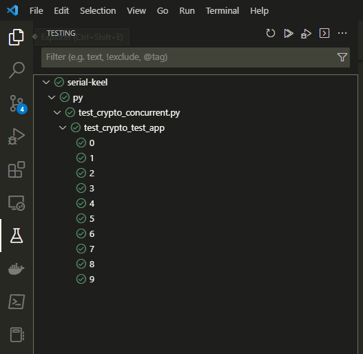
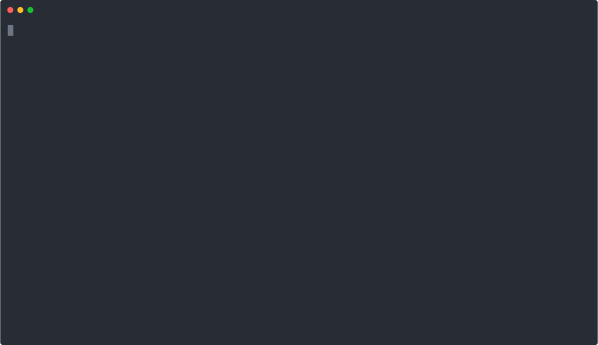
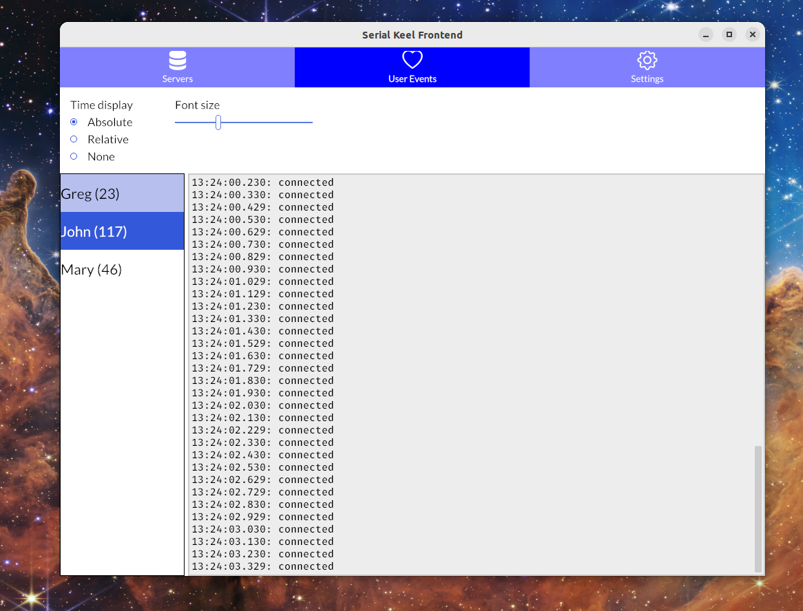

# Serial Keel
- [Serial Keel](#serial-keel)
  - [Running a server](#running-a-server)
    - [Using a configuration file](#using-a-configuration-file)
  - [Webserver HTTP endpoints](#webserver-http-endpoints)
    - [`localhost:3123/config`](#localhost3123config)
    - [`localhost:3123/version`](#localhost3123version)
  - [Cargo Features](#cargo-features)
    - [`mocks-share-endpoints`](#mocks-share-endpoints)
  - [How it works](#how-it-works)
    - [Concepts](#concepts)
      - [Message Format](#message-format)
      - [Client](#client)
      - [Server](#server)
      - [Endpoint](#endpoint)
      - [Control](#control)
      - [Observer](#observer)
      - [Group](#group)
    - [Examples](#examples)
      - [Client TTY session](#client-tty-session)
      - [Client mock session](#client-mock-session)
      - [Labelled group control](#labelled-group-control)
  - [Python client](#python-client)
    - [Pytest via vscode](#pytest-via-vscode)
  - [Rust client](#rust-client)
  - [Command line example client](#command-line-example-client)
  - [JavaScript example client](#javascript-example-client)
  - [Observability Frontend](#observability-frontend)
  - [Serial Keel as a systemd service](#serial-keel-as-a-systemd-service)
    - [**Note**](#note)

A server which helps ease working with TTYs.


_Thanks DALL-E! The keel does not look very serial-y, though._

Features:

- Server continuously monitors TTYs
  - No messages lost!
- An endpoint (e.g. `/dev/ttyACM0`) can have any number of listeners (called _observers_)
  - This means even though an endpoint is in use, others may observe what's going on
- Clients can `await` exclusive control over an endpoint
  - This provides write access
- Endpoints can be put into logical groups
  - Exclusive access now implies exclusivity over the whole group
- Any number of clients can wait for write access- the server automatically queues them (FIFO)
- Endpoints can be mocked
  - Write to it to instruct it to send back messages the same way a real device would
  - Allows separating TTY message logic from actual devices for rapid prototyping

- Communication between server and client is done via the [WebSocket Protocol](https://datatracker.ietf.org/doc/html/rfc6455)
  - Allows the server to work independently of which language the client is written in, since all request-responses are sent as JSON messages over the websocket
  - Why a web socket and not a TCP or UDP socket? Web sockets are a higher level abstraction and allows patterns such as:

```python
# Python
async for message in websocket:
    # Do thing with message,
    # allow other async code to progress while waiting
```

```text
// Rust
while let Some(Ok(msg)) = websocket.next().await {
    // Do thing with message,
    // allow other async code to progress while waiting
}
```

```js
// Javascript
websocket.addEventListener('message', (event) => {
    // Do thing with message
});
```

## Running a server
Start the server. Choose one of:

* `cargo r --bin serial-keel`, or `cargo r --release --bin serial-keel`, or, `cargo r --features mocks-share-endpoints --release --bin serial-keel` (see [cargo features](#cargo-features))
* Install, e.g.: `cargo install --path core --features mocks-share-endpoints`, then run it: `serial-keel`
  - The `core` is the server.
* Precompiled: `./bin/serial-keel` (TODO: Update this bin. TODO: The build-musl fails, investigate)

If you have installed serial keel, please use `serial-keel help` to explore what's available.

Use the environment variable `RUST_LOG` to control log verbosity, e.g. `export RUST_LOG=warn` or `export RUST_LOG=debug`.

> **Note:** Without using a configuration file Serial Keel will not open any TTYs.
> It might still be useful since mock endpoints can be created at runtime.
> See the [next section](#using-a-configuration-file) for using configuration files.

### Using a configuration file

Run `serial-keel examples config` to see an example configuration file.
You can store the output of this as `my-config.ron` to get started.

A short summary of the configuration file is:

- Allows choosing exactly which TTYs to open
- Allows grouping endpoints together
- Allows giving labels to groups and endpoints

## Webserver HTTP endpoints

Assuming you have a server running at `localhost:3123`.

### `localhost:3123/config`

```text
curl -X GET localhost:3123/config
```

This dumps the configuration the server is running with.
Useful to see endpoints, groups, and labels.

Currently it dumps it in the "native" format- RON.


### `localhost:3123/version`

```text
curl -X GET localhost:3123/version
```

This dumps the version the server version as definied in the project's manifest file.
Serialized as JSON (although it's just a string, e.g. `"0.1.0"`).

## Cargo Features

### `mocks-share-endpoints`

If a client connects and asks for control of `mock-foo`, then this endpoint is created on the spot.
This is to support mocking and not needing a separate API just to create mock endpoints.

However, when we want to test clients trying to queue over the same resources, we need to make mock endpoints shared.
This means two clients trying to access `mock-foo`, one is granted access and the other is queued.


## How it works

### Concepts

#### Message Format

All communication between clients and a server is done via serialized JSON messages.

Run `serial-keel examples` to get a list of examples you can run to show how these messages look like.

#### Client

The actor initiating a websocket connection to some active server.
Sends requests to the server, which replies with responses.

#### Server

Continuously listens to TTYs.
Serves clients over websockets.
The clients typically observe endpoints to receive serial messages, and/or control endpoints to send serial messages.

#### Endpoint

A thing which may produce serial messages and accepts being written to.

For example the endpoint `/dev/ttyACM0` or `COM0` represents real TTYs which can read and write messages.

Endpoints may also be mocked, and thus have any name e.g. `mock-1` or `specific-mocked-device-30`.

#### Control

Having "control" over an endpoint means having exclusive access to it, which implies write access.

#### Observer

Observing an endpoint means the server will send serial messages to the client when messages arrive on that observed endpoint.
All clients have observe rights, even over endpoints controlled by other clients.

#### Group

A group is a logical collection of endpoints.
Endpoints which are grouped together are gained write access to as a group.
This means a client gaining access to one member of a group simultaneously gets access to other members as well.

Use this when there is a dependence between endpoints in some way.
For example, some embedded devices are able to expose several TTYs to the host operating system. These are natural to group together.


### Examples

#### Client TTY session

Shows a client observing a single TTY endpoint.
The concept works the same for more endpoints.

- The TTY may at any point produce a message to the server
- The server will forward messages to any observer(s)
- Clients starting to observe will receive messages _from that point on_.

```text
┌────────┐                ┌────────┐      ┌────────────┐
│ client │                │ server │      │/dev/ttyACM0│
└───┬────┘                └────┬───┘      └─────┬──────┘
    │                          │                │
    │                          │                │
    │                          │    "LOREM"     │
    │              no observers│◄───────────────┤
    │                    x─────┤                │
    │                          │                │
    │                          │                │
    │  observe("/dev/ttyACM0") │                │
    ├─────────────────────────►│                │
    │                          │                │
    │                          │                │
    │                          │                │
    │   message("LOREM")       │    "LOREM"     │
    │   from "/dev/ttyACM0"    │◄───────────────┤
    │◄─────────────────────────┤                │
    │                          │                │
    │   message("IPSUM")       │    "IPSUM"     │
    │   from "/dev/ttyACM0"    │◄───────────────┤
    │◄─────────────────────────┤                │
    │                          │                │
    │   message("HELLO")       │    "HELLO"     │
    │   from "/dev/ttyACM0"    │◄───────────────┤
    │◄─────────────────────────┤                │
    │                          │                │
    │                          │                │
   ─┴─                         │                │
client                         │                │
disconnects                    │                │
```

#### Client mock session

This example shows the message passing
between a client and server for a mock session.

When a user asks to control a mock, the mock is created on the spot.
The mock endpoint (here `mock-foo`) is also unique for this user.
The mock cannot know what to emulate without being instructed on what to do.
Therefore write commands to a mock is echoed back, but split by lines.

This allows writing a whole text file which is then sent back line by line.

When the user disconnects the mock is removed leaving no state.

> **Note:** Requests from the client are always responded right away,
> but messages on an endpoint are sent asynchronously to the client.


```text
┌────────┐                ┌────────┐
│ client │                │ server │
└───┬────┘                └────┬───┘
    │                          │
    │                          │
    │     control("mock-foo")  │
    ├─────────────────────────►│
    │                          ├───────────┐
    │                          │ initialize│
    │                          │"mock-foo" │
    │     control granted      │◄──────────┘
    │◄─────────────────────────┤
    │                          │
    │                          │
    │     observe("mock-foo")  │
    ├─────────────────────────►│
    │            ok            │
    │◄─────────────────────────┤
    │                          │
    │                          │
    │                          │
    │write("LOREM\nIPSUM\nFOO")│
    │  to endpoint "mock-foo"  │
    │                          │
    ├─────────────────────────►│
    │                          ├───────────┐
    │                          │ "mock-foo"│
    │                          │ receives  │
    │                          │ text      │
    │        write ok          │◄──────────┘
    │◄─────────────────────────┤
    │                          │
    │       message("LOREM")   │
    │       from "mock-foo"    │
    │◄─────────────────────────┤
    │                          │
    │       message("IPSUM")   │
    │       from "mock-foo"    │
    │◄─────────────────────────┤
    │                          │
    │       message("FOO")     │
    │       from "mock-foo"    │
    │◄─────────────────────────┤
    │                          │
    │                          │
   ─┴─                         │
client                         │
disconnects                    │
                       remove  │
                     "mock-foo"│
                               │
```

#### Labelled group control

This example is a bit more involved.

- Three clients
- Four endpoints
- Endpoints are grouped into two groups
- The groups share an arbitrary label "device-combo"

The concept shown here is that clients may ask to control any endpoint (or group) which matches some label.
Labels are set via the server configuration file (see [using a configuration file](#using-a-configuration-file)).

The other concept shown is that control is tied to the connection of the client.
When a client disconnects control is released and the next in queue (if any) gets control.

See below the diagram for an explanation of the numbered events in this example.

```text
┌─────────┐ ┌─────────┐ ┌─────────┐             ┌────────┐ ┌────────────────────────────────┐ ┌────────────────────────────────┐
│ client1 │ │ client2 │ │ client3 │             │ server │ │ group1, label: "device-combo"  │ │ group2, label: "device-combo"  │
└───┬─────┘ └───┬─────┘ └───┬─────┘             └────┬───┘ │                                │ │                                │
    │           │           │ control-any(           │     │ ┌────────────┐  ┌────────────┐ │ │ ┌────────────┐  ┌────────────┐ │
    │ 1.        │           │   "device-combo")      │     │ │/dev/ttyACM0│  │/dev/ttyACM1│ │ │ │/dev/ttyACM3│  │/dev/ttyACM4│ │
    ├───────────┼───────────┼───────────────────────►│     │ └─────┬──────┘  └─────┬──────┘ │ │ └─────┬──────┘  └─────┬──────┘ │
    │           │           │  control granted       │     │       │               │        │ │       │               │        │
    │ 2.        │           │  (group1)              │     └───────┼───────────────┼────────┘ └───────┼───────────────┼────────┘
    │◄──────────┼───────────┼────────────────────────┤             │               │                  │               │
    │           │           │                        │             │               │                  │               │
    │           │           │                        │             │               │                  │               │
    │           │           │                        │             │               │                  │               │
    │           │           │                        │             │               │                  │               │
    │           │           │                        │             │               │                  │               │
    │           │           │  control-any(          │             │               │                  │               │
    │           │ 3.        │    "device-combo")     │             │               │                  │               │
    │           ├───────────┼───────────────────────►│             │               │                  │               │
    │           │           │  control granted       │             │               │                  │               │
    │           │ 4.        │  (group2)              │             │               │                  │               │
    │           │◄──────────┼────────────────────────┤             │               │                  │               │
    │           │           │                        │             │               │                  │               │
    │           │           │                        │             │               │                  │               │
    │           │           │                        │             │               │                  │               │
    │           │           │                        │             │               │                  │               │
    │           │           │  control-any(          │             │               │                  │               │
    │           │           │    "device-combo")     │             │               │                  │               │
    │           │        5. ├───────────────────────►│             │               │                  │               │
    │           │           │                        │             │               │                  │               │
    │           │           │  queued                │             │               │                  │               │
    │           │        6. │◄───────────────────────┤             │               │                  │               │
    │           │           │                        │             │               │                  │               │
    │           │           │                        │             │               │                  │               │
    │           │           │                        │             │               │                  │               │
    │           │           │                        │             │               │                  │               │
    │           │           │  write("hello world")  │             │               │                  │               │
    │           │ 7.        │  to "/dev/ttyACM3"     │  "hello     │               │                  │               │
    │           ├───────────┼───────────────────────►│   world"    │               │                  │               │
    │           │           │                        ├─────────────┼───────────────┼─────────────────►│               │
    │           │ 8.        │  write ok              │             │               │                  │               │
    │           │◄──────────┼────────────────────────┤             │               │                  │               │
    │           │           │                        │             │               │                  │               │
    │           │           │                        │             │               │                  │               │
    │       9. ─┴─          │                        │             │               │                  │               │
    │        client         │                        │             │               │                  │               │
    │        disconnects    │                        │             │               │                  │               │
    │        (group2 now    │                        │             │               │                  │               │
    │         available)    │                        │             │               │                  │               │
    │                       │                        │             │               │                  │               │
    │                       │                        │             │               │                  │               │
    │                       │  control granted       │             │               │                  │               │
    │                       │  (group2)              │             │               │                  │               │
    │                   10. │◄───────────────────────┤             │               │                  │               │
    │                       │                        │             │               │                  │               │
    │                       │                        │             │               │                  │               │
 11.│                   12. │                        │             │               │                  │               │
   ─┴─                     ─┴─                       │             │               │                  │               │
client                  client                       │             │               │                  │               │
disconnects             disconnects
(group1 now             (group2 now
 available)              available)
```

Explanation of events:

1. `client1` asks to control anything matching the label "device-combo".
2. The server grants control to all endpoints in `group1` since it matched the label and was available. Note that the server might as well have given access to `group2` here.
3. `client2` asks control over any "device-combo" too.
4. `group2` matched and was available and is granted.
5. `client3` asks control over any "device-combo".
6. The server sees two groups matching, but all are taken. It queues the client.
7. `client2` has control over endpoints in `group2`. The server sent information about those endpoints (not shown), but `client2` therefore knows `/dev/ttyACM3` is controllable. `client2` writes a message to `/dev/ttyACM3`.
8. The server saw that `client2` had write access to `/dev/ttyACM3`. It wrote the message to the endpoint, i.e. it put the message "on wire". It therefore sends a "write ok" message back to the client.
9. `client2` leaves. The server notices and frees the resources `client2` had, which means `group2` is now available again.
10. The server saw that a resource matching what `client3` wants is now available, and grants `client3` control over it.
11. `client1` leaves (without ever using its resources just to make the example simpler). This frees `group1`.
12. `client3` leaves. This frees `group2`.

## Python client

There is an async Python client for Serial Keel. See the [README](py/README.md) for the serial-keel python client first before continuing below.

Install the serial keel python client libraries with `pip install serialkeel`

To build the serialkeel python client locally, install the `build` pip package, `cd` into the `./py` directory and run
```shell
python3 -m build
```
This should create a .whl file in a new `./py/dist/` folder. Install it with `pip install ./py/dist/*.whl`

### Pytest via vscode

With the serialkeel python package installed, and if you tell vscode to use Pytest, we can get a nice interface:

**TODO: Not displayed in rust doc**



To enable this, add `.vscode/settings.json` to this workspace and add these contents:

```json
{
  "python.testing.pytestArgs": ["py"],
  "python.testing.unittestEnabled": false,
  "python.testing.pytestEnabled": true
}
```

You can run all tests, individual tests, or debug tests like this.

## Rust client

Here is a very simple mock session using the Rust client.



## Command line example client

_This is not meant to be practical- it's just to show that Serial Keel is client agnostic._

Serial Keel communicates over websockets. The server and client sends JSON messages back and forth.
Therefore we can have a session on the command line.

This uses [websocat](https://github.com/vi/websocat).


## JavaScript example client

_There is no real JavaScript client. Just a short example in JavaScript._


## Observability Frontend

There is a WIP GUI which can be started via (from the root folder) `cargo r --bin frontend-iced`.



It's quite barebones right now, but the goal is the be able to attach to any running Serial Keel instance and see the
user events and also the raw logs from each endpoint in real time.

## Serial Keel as a systemd service

You can setup Serial Keel to run as a systemd service on startup. In `scripts/systemd`, you'll find a template `.service`
file and an `install_serial_keel.sh` script.

Running the install script with the template file, specified branch (defaults to `main` if not specified) and path to the config file
will create a user service. It will also build serial-keel and install it.

You can invoke this script as below:

```text
./scripts/systemd/install_serial_keel.sh <branch-name> <path-to-config-file>
```

- Once done, the serial-keel service should be running. Running `systemctl --user status serial-keel.service`
should let you know whether the service started successfully.

- Logs are accessed via `journalctl`. Check `man journalctl` for usage. Here is an example:

Example:

```text
journalctl --since "2 days ago" --user-unit serial-keel --output=cat
- You can access the latest logs of the serial-keel service with:

### **Note**
- The `check_and_upgrade_serial_keel.sh` is executed every time the serial-keel service restarts,
which checks for new changes on remote and performs an upgrade if necessary.
